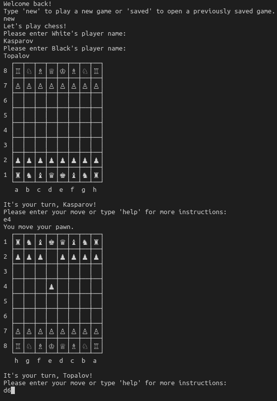

# Chess
This is a command line chess game, where two players can enter moves to play against each other. It was done as the final assignment for the Ruby course part of [The Odin Project](https://www.theodinproject.com/lessons/ruby-final-project).

## Approach
My main goal for this project was to apply the object-oriented design principles that I just learned from [this book](https://www.poodr.com/) as much as I could. 

Additionally, I wanted to implement as many of the rules of classic chess as possible (as described [here](https://www.chessvariants.com/d.chess/chess.html)). That means that I had to allow castling and en-passant taking moves. 

The only significant rule I left out is pawn promotion. However, given the way the components of my program are set up, I feel this would be easy to add later. 

## Features
- The game can be saved at any time.
- When there are saved games, the user is prompted to choose either to start a new game or to continue a saved game. 
- The board is displayed with the conventional column-letters and row-numbers. 
- The board is shown from the perspective of the current player. 
- To make a move, players type in a command such as 'knight to c3'. Most variations of this (for example 'C 3 Knight') will also work.  
- Following convention, I made naming the square (ex. 'e4') sufficient for pawn moves.
- When more than one piece can move to the given square, a player is given a list of possibilities with the option to choose which piece they want to move. 
- Players can give commands such as 'help', 'resign', 'save' or 'quit' at any time. 

## Thoughts
This was definitely the most challenging project so far, requiring a much more rigorous planning and testing approach. It's given me a feel for building a slightly larger application with lots of different components from start to finish. It's also helped me practise my Git commands: I branched out a few times to test out features that I wasn't sure of at first. 

For this project I've been very strict with myself: the point was to prove that I've learned enough Ruby to be able to write a chess application. I definitely think that this was a great way to start practising good design principles. Approaching this from a message-based point of view has absolutely made me feel more secure in how to start designing a new app. Testing has also become a lot easier and more efficient for me now. 

I did run into some pretty savage bugs with my #check?, #checkmate? and #stalemate? methods. Thinking the algorithm side of things through logically and more completely in advance would have helped, and this is of course something I want to get better at as I write more applications. 

I also feel that my Board is responsible for quite a lot - I'm still on the fence on whether it should know less than it does or not. Getting a Piece to ask the Board whether its proposed move causes the king to be in check doesn't feel quite right, but it does work, and for now I'm leaving that where it is. 

So I know that there are lots of ways in which I could still refactor things and improve on this project, but I think I'm ready to move on. I would love to revisit this later, possibly to create a web application. 

In the meantime I'm very happy to have completed this!